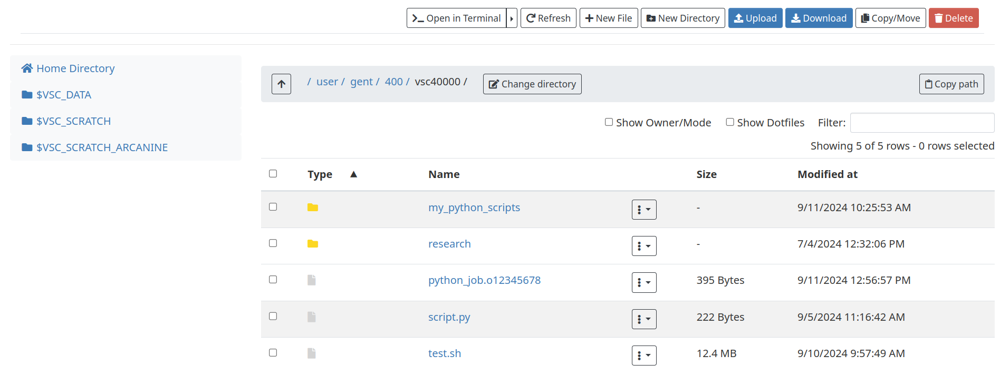
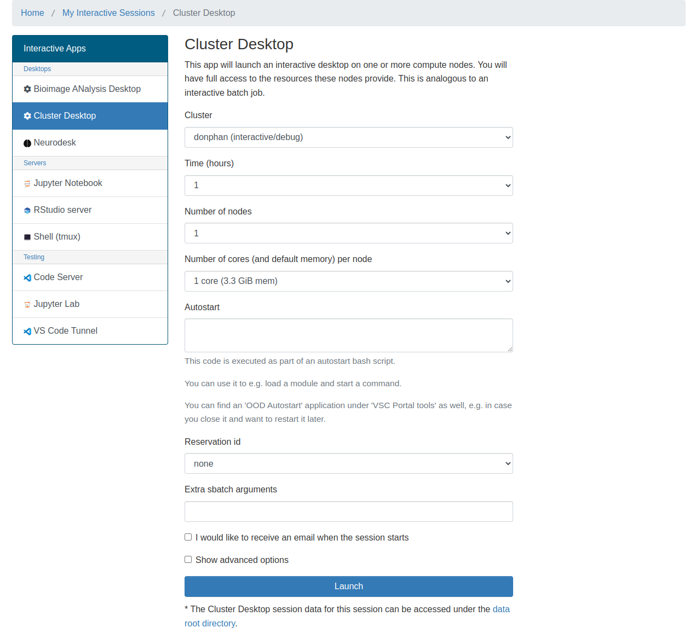

# Using the HPC-UGent web portal

The HPC-UGent web portal provides "one stop shop" for the HPC-UGent
infrastructure. It is based on [Open OnDemand](https://openondemand.org/) (or `OoD`
for short).

Via this web portal you can upload and download files, create, edit,
submit, and monitor jobs, run GUI applications, and connect via SSH, all
via a standard web browser like Firefox, Chrome or Safari. You do not
need to install or configure any client software, and no SSH key is
required to connect to your VSC account via this web portal.\
Please note that we do recommend to use our interactive and debug
cluster (see chapter [interactive and debug cluster](./interactive_debug.md)) with `OoD`.

To connect to the HPC-UGent infrastructure via the web portal, visit <https://login.hpc.ugent.be>

Note that you may only see a "*Submitting...*" message appear for a
couple of seconds, which is perfectly normal.

Through this web portal, you can:

-   browse through the files & directories in your VSC account, and
    inspect, manage or change them;

-   consult active jobs (across all HPC-UGent Tier-2 clusters);

-   submit new jobs to the HPC-UGent Tier-2 clusters, either from
    existing job scripts or from job templates;

-   start an interactive graphical user interface (a desktop
    environment), either on the login nodes or on a cluster workernode;

-   open a terminal session directly in your web browser;

More detailed information is available below, as well as in the [Open
OnDemand
documentation](https://osc.github.io/ood-documentation/latest/). A
walkthrough video is available on YouTube
[here](https://www.youtube.com/watch?v=4-w-4wjlnPk).

## Pilot access

### Known issues & limitations

##### Limited resources

All web portal sessions are currently served through a single separate
login node, so the available resources are relatively limited. We will
monitor the resources used by the active web portal sessions throughout
the pilot phase to evaluate whether more resources are required.

## Login

When visiting the HPC-UGent web portal you will be automatically logged
in via the VSC accountpage (see also
Section [Applying for the account](../account/#applying-for-the-account)).

### First login

The first time you visit <https://login.hpc.ugent.be> permission will be
requested to let the web portal access some of your personal information
(VSC login ID, account status, login shell and institute name), as shown
in this screenshot below:

**Please click "Authorize" here.**

This request will only be made once, you should not see this again
afterwards.

## Start page

Once logged in, you should see this start page:

This page includes a menu bar at the top, with buttons on the left
providing access to the different features supported by the web portal,
as well as a *Help* menu, your VSC account name, and a *Log Out* button
on the top right, and the familiar HPC-UGent welcome message with a
high-level overview of the HPC-UGent Tier-2 clusters.

If your browser window is too narrow, the menu is available at the top
right through the "hamburger" icon:

## Features

We briefly cover the different features provided by the web portal,
going from left to right in the menu bar at the top.

### File browser

Via the *Files* drop-down menu at the top left, you can browse through
the files and directories in your VSC account using an intuitive
interface that is similar to a local file browser, and manage, inspect
or change them.

The drop-down menu provides short-cuts to the different `$VSC_*`
directories and filesystems you have access to. Selecting one of the
directories will open a new browser tab with the *File Explorer*:

Here you can:

-   Click a directory in the tree view on the left to open it;

-   Use the buttons on the top to:

    -   go to a specific subdirectory by typing in the path (via *Go
        To...*);

    -   open the current directory in a terminal (shell) session (via
        *Open in Terminal*);

    -   create a new file (via *New File*) or subdirectory (via *New
        Dir*) in the current directory;

    -   upload files or directories from your local workstation into
        your VSC account, in the correct directory (via *Upload*);

    -   show hidden files and directories, of which the name starts with
        a dot (`.`) (via *Show Dotfiles*);

    -   show the owner and permissions in the file listing (via *Show
        Owner/Mode*);

-   Double-click a directory in the file listing to open that directory;

-   Select one or more files and/or directories in the file listing,
    and:

    -   use the *View* button to see the contents (use the button at the
        top right to close the resulting popup window);

    -   use the *Edit* button to open a simple file editor in a new
        browser tab which you can use to make changes to the selected
        file and save them;

    -   use the *Rename/Move* button to rename or move the selected
        files and/or directories to a different location in your VSC
        account;

    -   use the *Download* button to download the selected files and
        directories from your VSC account to your local workstation;

    -   use the *Copy* button to copy the selected files and/or
        directories, and then use the *Paste* button to paste them in a
        different location;

    -   use the *(Un)Select All* button to select (or unselect) all
        files and directories in the current directory;

    -   use the *Delete* button to (**permanently!**) remove the selected files and
        directories;

For more information, see also
<https://www.osc.edu/resources/online_portals/ondemand/file_transfer_and_management>.

### Job management

Via the *Jobs* menu item, you can consult your active jobs or submit new
jobs using the *Job Composer*.

For more information, see the sections below as well as
<https://www.osc.edu/resources/online_portals/ondemand/job_management>.

#### Active jobs

To get an overview of all your currently active jobs, use the *Active
Jobs* menu item under *Jobs*.

A new browser tab will be opened that shows all your current queued
and/or running jobs:

You can control which jobs are shown using the *Filter* input area, or
select a particular cluster from the drop-down menu *All Clusters*, both
at the top right.

Jobs that are still queued or running can be deleted using the red
button on the right.

Completed jobs will also be visible in this interface, but only for a
short amount of time after they have stopped running.

For each listed job, you can click on the arrow ($>$) symbol to get a
detailed overview of that job, and get quick access to the corresponding
output directory (via the *Open in File Manager* and *Open in Terminal*
buttons at the bottom of the detailed overview).

#### Job composer

To submit new jobs, you can use the *Job Composer* menu item under
*Jobs*. This will open a new browser tab providing an interface to
create new jobs:

This extensive interface allows you to create jobs from one of the
available templates, or by copying an existing job.

You can carefully prepare your job and the corresponding job script via
the *Job Options* button and by editing the job script (see lower
right).

Don't forget to actually submit your job to the system via the green
*Submit* button!

##### Job templates

In addition, you can inspect provided job templates, copy them or even
create your own templates via the *Templates* button on the top:

### Shell access

Through the *Shell Access* button that is available under the *Clusters*
menu item, you can easily open a terminal (shell) session into your VSC
account, straight from your browser!

Using this interface requires being familiar with a Linux shell
environment (see
Appendix [Useful Linux Commands](../useful_linux_commands)).

To exit the shell session, type `exit` followed by *Enter* and then
close the browser tab.

Note that you can not access a shell session after you closed a browser
tab, even if you didn't exit the shell session first (unless you use
terminal multiplexer tool like `screen` or `tmux`).

### Interactive applications

#### Graphical desktop environment

To create a graphical desktop environment, use on of the *desktop on... node* buttons under *Interactive Apps* menu item. For example:

You can either start a desktop environment on a login node for some
lightweight tasks, or on a workernode of one of the HPC-UGent Tier-2
clusters if more resources are required. Keep in mind that for desktop
sessions on a workernode the regular queueing times are applicable
dependent on requested resources.

**Do keep in mind that desktop environments on a cluster workernode are limited to a maximum of 72 hours, just like regular jobs are.**

To access the desktop environment, click the *My Interactive Sessions*
menu item at the top, and then use the *Launch desktop on \... node*
button if the desktop session is *Running*:

It is also possible to relaunch a desktop session that has ended by clicking the icon on the top-right of the desktop session box:

#### Jupyter notebook

See [dedicated page on Jupyter notebooks](../jupyter)

#### Transcribe

See [dedicated page on audio transcription app Transcribe](../transcribe)

## Restarting your web server in case of problems

In case of problems with the web portal, it could help to restart the
web server running in your VSC account.

You can do this via the *Restart Web Server* button under the *Help*
menu item:

Of course, this only affects your own web portal session (not those of
others).

### Enable debug logging for interactive apps

When investigating an issue with an interactive app (e.g. failure to start),
it can be very helpful (or you will be asked to by support)
to provide more debugging information in the output log file.
To do so, tick `Show advanced options` button (right above the `Launch` button),
and tick `Enable extra debugging code to help debug problems` button that right above it.

Once the issue is resolved, you can do the same steps to untick the `Enable extra debugging code to help debug problems` button again
or it will add the additional commands and output with every interactive app you start, and it is not recommended to do this by default.

## Custom apps

* [ABAQUS for CAE course](web_portal_custom_apps/abaqus_cae.md)
